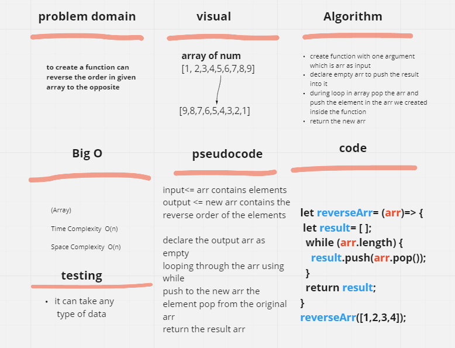

# Reverse an Array
enter an array and get a reverse characters as output

## Whiteboard Process

## Approach & Efficiency

tryed to solve the problem suit numbers and other type of data if we use in arr