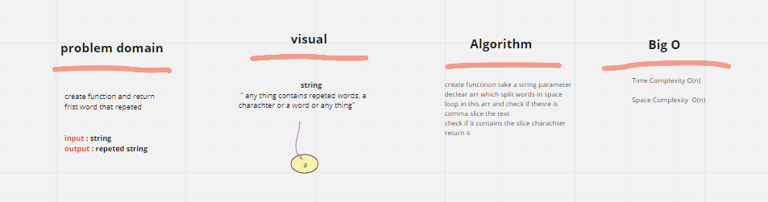

## Tree intrasection - 33

find values exist in two trees

## testing

- [ ] three test sample

## whiteboard

## repeted word - 32

Find the first repeated word in a book 

## testing

- [x] three test sample

## whiteboard

