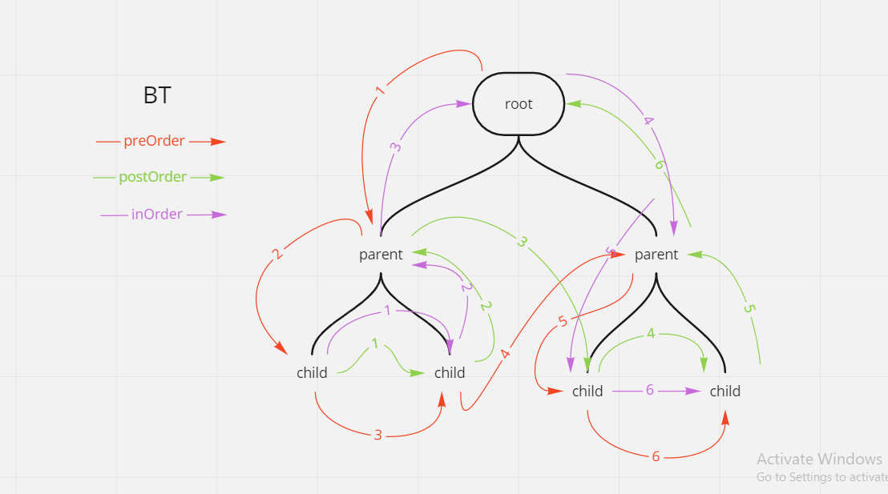
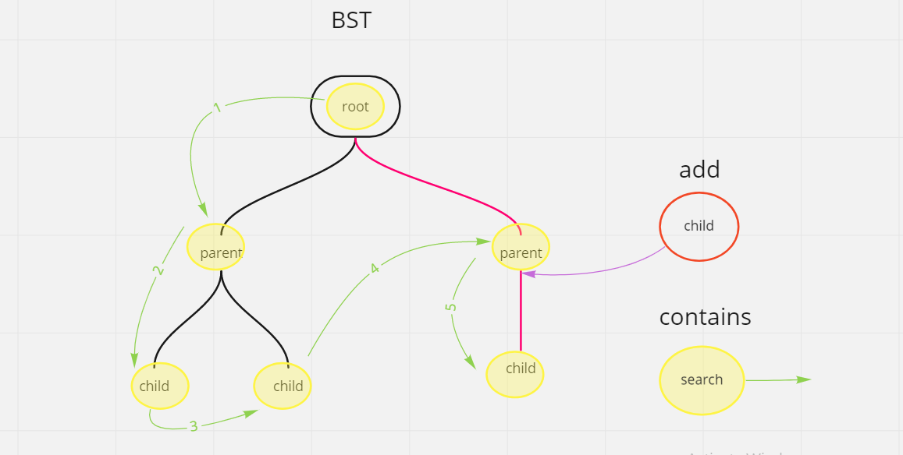
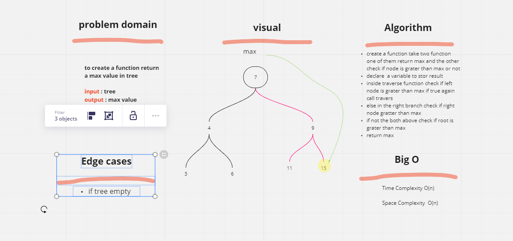
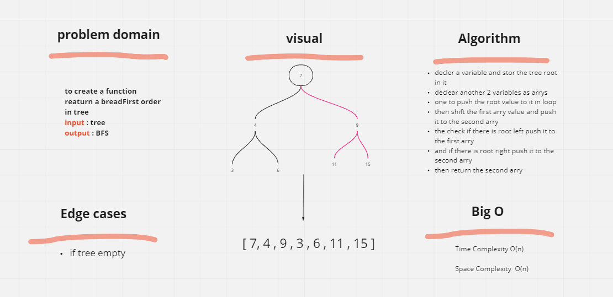

# Code Challenge: Class 15: Binary Tree and BST Implementation

## Binary Tree

- [x] Create a Binary Tree class  
       #Define a method for each of the depth first traversals:
- [x] pre order
- [x] in order
- [x] post order which returns an array of the values, ordered appropriately.

## Binary Search Tree

- [x] Create a Binary Search Tree class  
       #This class should be a sub-class (or your languages equivalent) of the Binary Tree Class, with the following additional methods:
- [x] Add
- [x] Contains

## testing

- [x] Can successfully instantiate an empty tree
- [x] Can successfully instantiate a tree with a single root node
- [x] Can successfully add a left child and right child to a single root node
- [x] Can successfully return a collection from a preorder traversal
- [x] Can successfully return a collection from an inorder traversal
- [x] Can successfully return a collection from a postorder traversal

## whiteboard

# Code Challenge: Class 16

## tree-max

find the max value in tree

## Challenge

- [x] find maximum value
- [ ] testing

## Approach & Efficiency

tried to simple solution

## whiteboard

# Code Challenge: Class 17

## Breadth tree first

Breadth tree first oreder

## Challenge

- [x] bread first order
- [ ] testing

## Approach & Efficiency

tried to simple solution

## whiteboard

