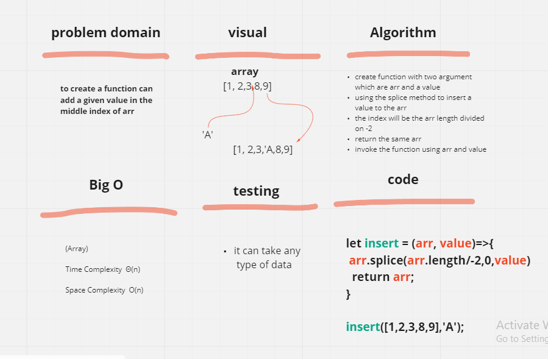

# array-insert-shifty
insert a value in the middle index of array   

## Whiteboard Process

## Approach & Efficiency

tryed to solve the problem suit all type of data and if the arr length with odd index , to give the new element odd index