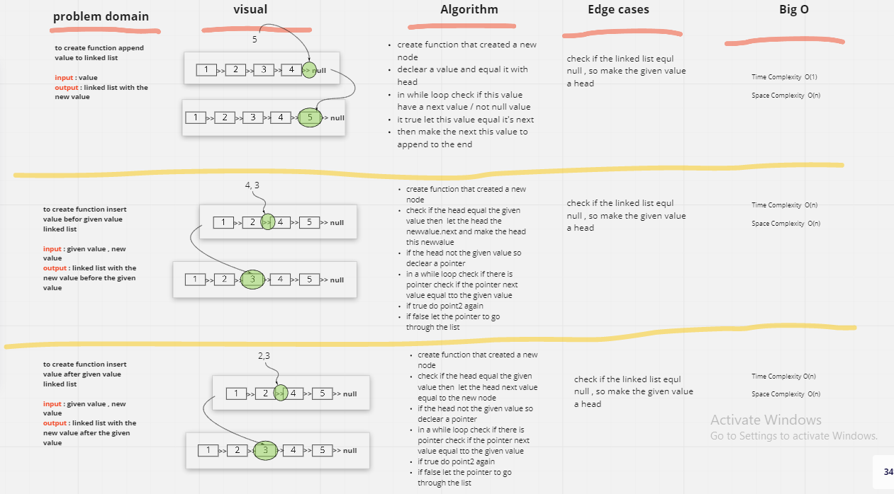
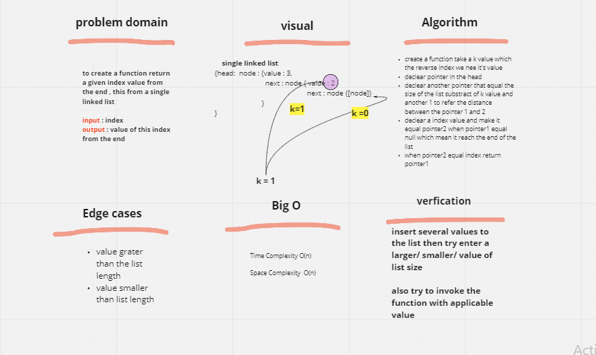

# Code Challenge: Class 05: Linked List Implementation  

- [x] Create a Node class that has properties for the value stored in the Node, and a pointer to the next Node.

- [x] Create a Linked List class
- [x] Within your Linked List class, include a head property.
- [x] Upon instantiation, an empty Linked List should be created.   

* **The class should contain the following methods**
- [x] insert
      Arguments: value
      Returns: nothing
      Adds a new node with that value to the head of the list with an O(1) Time performance.
- [x] includes
      Arguments: value
      Returns: Boolean
      Indicates whether that value exists as a Node’s value somewhere within the list.
- [x] to string
      Arguments: none
      Returns: a string representing all the values in the Linked List, formatted as:
"{ a } -> { b } -> { c } -> NULL"     

* **testing**

- [x] Can successfully instantiate an empty linked list  
- [x] Can properly insert into the linked list  linked list  
- [x] The head property will properly point to the first node in the linked list  
- [x] Can properly insert multiple nodes into the linked list  
- [x] Will return true when finding a value within the linked list that exists  
- [x] Will return false when searching for a value in the linked list that does not exist  
- [x] Can properly return a collection of all the values that exist in the linked list   

# Code Challenge: Class 06   

## Challenge Summary   

* **The class should contain the following methods**   

- [x] append   
arguments: new value   
adds a new node with the given value to the end of the list   
- [x] insert before   
arguments: value, new value   
adds a new node with the given new value immediately before the first node that has the value specified   
- [x] insert after   
arguments: value, new value   
adds a new node with the given new value immediately after the first node that has the value specified   

* **testing**   
 
- [x] Can successfully add a node to the end of the linked list  
- [x] Can successfully add multiple nodes to the end of a linked list  
- [x] Can successfully insert a node before a node located i the middle of a linked list  
- [x] Can successfully insert a node before the first node of a linked list  
- [x] Can successfully insert after a node in the middle of the linked list  
- [x] Can successfully insert a node after the last node of the linked list  
## Whiteboard Process
<!-- Embedded whiteboard image -->

## Approach & Efficiency
<!-- What approach did you take? Why? What is the Big O space/time for this approach? -->
find a solution pass the test xD
## Solution
<!-- Show how to run your code, and examples of it in action -->
run `npm test` to show the result

-------------------------
# Code Challenge: Class 07

# linked-list-kthfrom the end 
- [x] kth from end
- [x] Where k is greater than the length of the linked list
- [x] Where k and the length of the list are the same
- [x] Where k is not a positive integer
- [x] Where the linked list is of a size 1  
## Whiteboard Process

## Approach & Efficiency

try to use only one loop inside the function 

## Solution
run `npm test` to show the result