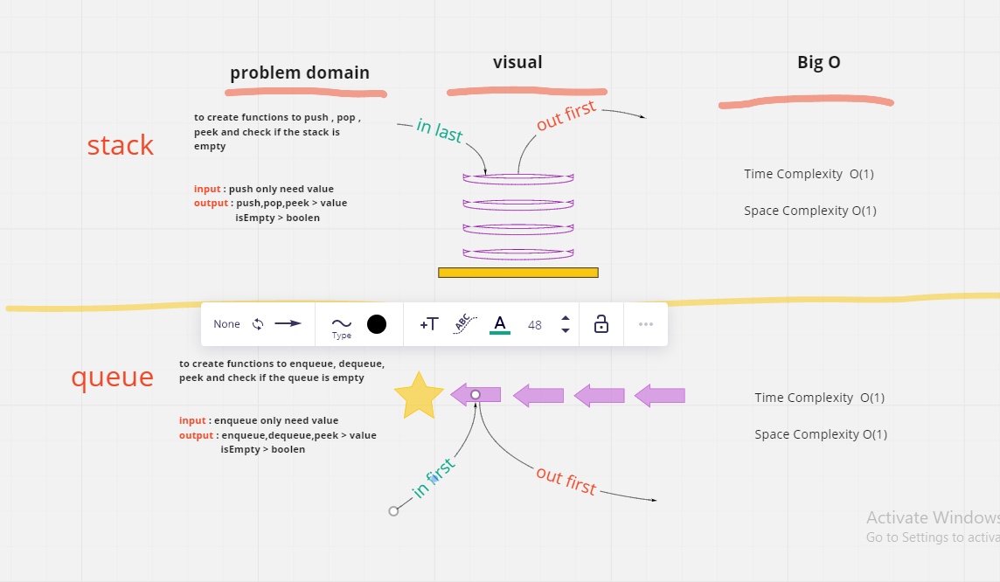

# Code Challenge: Class 10
## Stacks and Queues
stack look like a palette of pancake , firt add last pop , last add first pop

queue look like a queue , how comes first will pop first , how comes at the end will pop last one  

## Challenge
add , pop , return peek and check if stack or queue is empty   -->

## Approach & Efficiency
tried to create o(1) functions   

## test

- [x] Can successfully push onto a stack
- [x] Can successfully push multiple values onto a stack
- [x] Can successfully pop off the stack
- [x] Can successfully empty a stack after multiple pops
- [x] Can successfully empty a stack after multiple pops
- [x] Can successfully peek the next item on the stack
- [x] Can successfully instantiate an empty stack
- [x] Calling pop or peek on empty stack raises exception
- [x] Can successfully enqueue into a queue
- [x] Can successfully enqueue multiple values into a queue
- [x] Can successfully dequeue out of a queue the expected value
- [x] Can successfully peek into a queue, seeing the expected value
- [x] Can successfully empty a queue after multiple dequeues
- [x] Can successfully instantiate an empty queue
- [x] Calling dequeue or peek on empty queue raises exception

## Solution
run `npm test` to show the result

## whitebord

